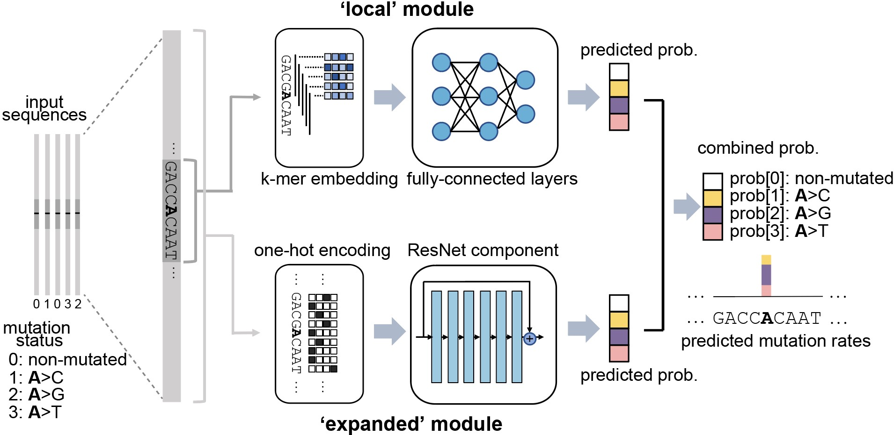

## MuRaL: inferring genomic mutation rate maps via deep learning
1. [Introduction](#Introduction)
2. [Installation and usage](#Usage)
3. [Pre-trained models and predicted mutation rate maps](#Trained_models)
4. [Citation](#Citation)
5. [Contact](#Contact)

## 1. Introduction 
Germline mutation rates are important in genetics, genomics and evolutionary biology. It is long known that mutation rates vary substantially across the genome, but existing methods can only obtain very rough estimates of local mutation rates and are difficult to be applied to non-model species. 

**MuRaL**, short for **Mu**tation **Ra**te **L**earner, is a generalizable framework to estimate single-nucleotide mutation rates based on deep learning. MuRaL has better predictive performance at different scales than current state-of-the-art methods. Moreover, it can generate genome-wide mutation rate maps with rare variants from a moderate number of sequenced individuals (e.g. ~100 individuals), and can leverage transfer learning to further reduce data and time requirements. It can be applied to many sequenced species with population polymorphism data. 

The MuRaL network architecture has two main modules (shown below), one is for learning signals from local genomic regions (e.g. 10bp on each side of the focal nucleotide), the other for learning signals from expanded regions (e.g. 1Kb on each side of the focal nucleotide).

Below is an example showing that MuRaL-predicted rates (colored lines) are highly correlated with observed mutation rates (grey shades) at different scales on Chr3 of *A. thaliana*. 

### 2. Installation and usage 
For detailed information about installation and usage, please go to [MuRaL documentation site](https://mural.readthedocs.io).

### 3. Trained models and predicted mutation rate maps of multiple species 
Trained models for four species - ***Homo sapiens***, ***Macaca mulatta***, ***Arabidopsis thaliana*** and ***Drosophila melanogaster*** are provided in the 'models/' folder of the package. One can use these model files for prediction or transfer learning.
 
Predicted single-nucleotide mutation rate maps for these genomes are available at [ScienceDB](https://www.doi.org/10.11922/sciencedb.01173).

### 4. Citation 
Fang Y, Deng S, Li C. A generalizable deep learning framework for inferring fine-scale germline mutation rate maps. *Nature Machine Intelligence* (2022) [doi:10.1038/s42256-022-00574-5](https://doi.org/10.1038/s42256-022-00574-5)

### 5. Contact 
For reporting issues or requests related to the package, please write to mural-project@outlook.com.
