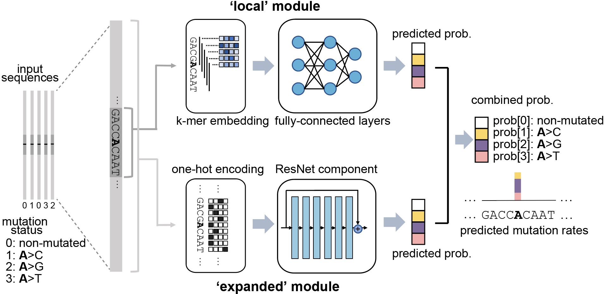

## 1. Overview
**MuRaL**, short for **Mu**tation **Ra**te **L**earner, is a computational framework based on neural networks to learn and predict single-nucleotide mutation rates. 

The MuRaL network architecture has two main modules (shown below), one is for learning signals from local genomic regions (e.g. 10bp on each side of the focal nucleotide) of a focal nucleotide, the other for learning signals from expanded regions (e.g. 1Kb on each side of the focal nucleotide).



## 2. Installation
MuRaL depends on several other packages, and we recommend using [Miniconda](https://docs.conda.io/en/latest/miniconda.html) (version 3 or newer) to create a conda environment for installing MuRaL and its dependencies. Please refer to Miniconda's documentation for its installation.

After installing Miniconda, download or clone the MuRaL source code from github and go into the source code root folder 'MuRal-xxx/'.

MuRaL supports training and prediction with or without CUDA GPUs. Please be aware that training/prediction without GPUs will take a much longer time. If your computing environment has CUDA GPUs, you may check the CUDA driver version (e.g. via `nvidia-smi`) and specify a compatible `cudatoolkit` version in the `environment.yml` file under the code root folder. You can find the information about CUDA compatibility from [here](https://docs.nvidia.com/deploy/cuda-compatibility/).

Before installing MuRaL, use `conda` command from Miniconda to create an environment and install the dependencies. The dependencies are included in `environment.yml` (if using GPUs) or `environment_cpu.yml` (if CPU-only computing). Run one of the following commands to create a conda environment and install the dependencies (this may take >30 minutes depending on your internet speed):


```sh
%%sh
# if your machine has GPUs
conda env create -n mural -f environment.yml
```


```sh
%%sh
# if your machine has only CPUs
conda env create -n mural -f environment_cpu.yml
```

If the command ends without errors, you will have a conda environment named 'mural' (or another name if you change the `-n mural` option above). Use the following command to activate the conda environment:


```sh
%%sh
conda activate mural
```

And then install MuRaL by typing:


```sh
%%sh
python setup.py install
```

If the installation is complete, three commands are available from the command line:
   * `mural_train`: This tool is for training mutation rate models from the beginning.
   * `mural_train_TL`: This tool is for training transfer learning models, taking advantage of learned weights of a pre-trained model.
   * `mural_predict`: This tool is for predicting mutation rates of new sites with a trained model.

## 3. Usage Examples
### 3.1 Model training
`mural_train` trains MuRaL models with training and validation mutation data, and exports training results under the "./ray_results/" folder.
   * Input data \
   Input data files include the reference sequence file (FASTA format, required), a training data file (required) and a validation data file (optional). If the validation data file isn't provided, a fraction of the sites sampled from the training data file are used as validation data. \
   Input training and validation data files are in BED format (more info about BED at https://genome.ucsc.edu/FAQ/FAQformat.html#format1). Some example lines of an input BED file are shown below.
```
chr1	2333436	2333437	.	0	+ 
chr1	2333446	2333447	.	2	-
chr1	2333468	2333469	.	1	-
chr1	2333510	2333511	.	3	-
chr1	2333812	2333813	.	0	- 
```
   In the BED-formatted lines above, the 5th column is used to represent mutation status: usually, '0' means the non-mutated status and other numbers means specific mutation types (e.g. '1' for 'A>C', '2' for 'A>G', '3' for 'A>T'). You can specify an arbitrary order for a group of mutation types with incremental numbers starting from 0, but make sure that the same order is consistently used in training, validation and testing datasets. Importantly, the training and validation BED file MUST BE SORTED by chromosome coordinates. You can sort BED files by `bedtools sort` or `sort -k1,1 -k2,2n`.
   
   * Output data \
    `mural_train` saves the model information at each checkpoint, normally at the end of each training epoch of each trial. The checkpointed model files during training are saved under folders named like:
```
    ./ray_results/your_experiment_name/Train_xxx...xxx/checkpoint_x/
            - model
            - model.config.pkl
            - model.fdiri_cal.pkl
```
   In the above folder, the 'model' file contains the learned model parameters. The 'model.config.pkl' file contains configured hyperparameters of the model. The 'model.fdiri_cal.pkl' file (if exists) contains the calibration model learned with validation data, which can be used for calibrating predicted mutation rates. These files can be used in downstream analyses such as model prediction and transfer learning.

* Example 1 \
   The following command will train a model by running two trials, using data in 'data/training.sorted.bed' for training. The training results will be saved under the folder './ray_results/example1/'. Default values will be used for other unspecified arguments. Note that, by default, 10% of the sites sampled from 'training.sorted.bed' is used as validation data (i.e. '--valid_ratio 0.1'). You can run this example under the 'examples/' folder in the package.


```sh
%%sh
mural_train --ref_genome data/seq.fa --train_data data/training.sorted.bed --experiment_name example1 > test1.out 2> test1.err
```

* Example 2 \
   The following command will use data in 'data/training.sorted.bed' as training data and a separate 'data/validation.sorted.bed' as validation data. The option '--local_radius 7' means that length of the local sequence used for training is 7\*2+1 = 15 bp. '--distal_radius 200' means that length of the expanded sequence used for training is 200\*2+1 = 401 bp. You can run this example under the 'examples/' folder in the package.


```sh
%%sh
mural_train --ref_genome data/seq.fa --train_data data/training.sorted.bed --validation_data data/validation.sorted.bed --n_trials 2 --local_radius 7 --distal_radius 200 --experiment_name example2 > test2.out 2> test2.err
```

* Example 3 \
   If you don't have (or don't want to use) GPU resources, you can set options `--ray_ngpus 0 --gpu_per_trial 0`. The example uses only CPU resources below.


```sh
%%sh
mural_train --ref_genome data/seq.fa --train_data data/training.sorted.bed --validation_data data/validation.sorted.bed --ray_ngpus 0 --gpu_per_trial 0 --n_trials 2 --local_radius 7 --distal_radius 200 --experiment_name example3 > test3.out 2> test3.err
```

### 3.2 Model prediction
`mural_predict` predicts mutation rates for all sites in a BED file based on a trained model.
   * Input data \
   The required input files for prediction include the reference FASTA file, a BED-formated data file and a trained model. The BED file is organized in the same way as that for training. The 5th column can be set to '0' if no observed mutations for the sites in the prediction BED. The model-related files for input are 'model' and 'model.config.pkl', which are generated at the training step. The file 'model.fdiri_cal.pkl', which is for calibrating predicted mutation rates, is optional.
   * Output data \
   The output of `mural_predict` is a tab-separated file containing the sequence coordinates (BED-formatted) and the predicted probabilities for all possible mutation types. Usually, the 'prob0' column contains probalities for the non-mutated class and other 'probX' columns for mutated classes. 
   Some example lines of a prediction output file are shown below. 
```
chrom   start   end    strand mut_type  prob0   prob1   prob2   prob3
chr1    10006   10007   -       0       0.9797  0.003134 0.01444 0.002724
chr1    10007   10008   +       0       0.9849  0.005517 0.00707 0.002520
chr1    10008   10009   +       0       0.9817  0.004801 0.01006 0.003399
chr1    10012   10013   -       0       0.9711  0.004898 0.02029 0.003746
```

* Example 3 \
   The following command will predict mutation rates for all sites in 'data/testing.bed.gz' using model files under the 'models/checkpoint_6/' folder and save prediction results into 'testing.ckpt6.fdiri.tsv.gz'. You can run this example under the 'examples/' folder in the package.


```sh
%%sh
mural_predict --ref_genome data/seq.fa --test_data data/testing.bed --model_path ray_results/example2/Train_ba2c1_00001/checkpoint_4/model --model_config_path ray_results/example2/Train_ba2c1_00001/checkpoint_4/model.config.pkl --calibrator_path ray_results/example2/Train_ba2c1_00001/checkpoint_4/model.fdiri_cal.pkl --pred_file testing.ckpt4.fdiri.tsv.gz > test4.out 2> test4.err
```

### 3.3 Transfer learning
`mural_train_TL` trains MuRaL models like `mural_train` but initializes model parameters with learned weights from a pre-trained model. Its training results are also saved under the "./ray_results/" folder.
   * Input data \
   The input files for `mural_train_TL` include the reference FASTA file (required), a training data file (required), a validation data file (optional), and model-related files of a trained model (required). The required model-related files are 'model' and 'model.config.pkl' under a specific checkpoint folder, normally generated by `mural_train` or `mural_train_TL`. 
   * Output data \
   Output data has the same structure as that of `mural_train`.

   * Example 4 \
   The following command will train a transfer learning model using training data in 'data/training_TL.sorted.bed', the validation data in 'data/validation.sorted.bed', and the model files under 'models/checkpoint_6/'. You can run this example under the 'examples/' folder in the package.


```sh
%%sh
mural_train_TL --ref_genome data/seq.fa --train_data data/training_TL.sorted.bed --validation_data data/validation.sorted.bed --model_path models/checkpoint_6/model --model_config_path models/checkpoint_6/model.config.pkl --train_all --init_fc_with_pretrained --experiment_name example4 > test4.out 2> test4.err
```

### 3.4 Correlation calculation
We used two methods to calculate the correlation between the predicted rates and observed rate of the same sites. The predicted file is what we generated by using `mural_predict` before.
#### 3.4.1 K-mer correlation calculation
   * Input data \
   The input files for k-mer correlation calculation include the reference FASTA file (required), a predicted data file (required), the name of model (optional), the length of k-mer (required), and the name of result file (optional).
   * Output data \
   Output data will list three predicted rates, three observed rates, the actual number of three mutation types and the actual number for all kinds of k-mer. The k-mer correlation resluts will be listed in the last three lines in the order of mutation types (e.g., for A/T sites, the order is A>C, A>G and A>T). For each line, the results include k-mer correlation and p-value, which are separated by '**\t**' .
```
type	obs_rate1	obs_rate2	obs_rate3	avg_pred_prob1	avg_pred_prob2	avg_pred_prob3	number_of_mut1	number_of_mut2	number_of_mut3	number_of_total
TAG	0.006806776385512125	0.010141979926438501	0.012039461380213204	0.012744358544122413	0.01817057941563919	0.021860978496512425	3494	5206	6180	513312
TAA	0.007517292690907348	0.011278023120833133	0.01318808653952362	0.013600087566977897	0.019697007577734515	0.024266536859123104	7214	10823	12656	959654
AAA	0.0068964404639771226	0.010705555691654661	0.009617493130148654	0.012599749576515839	0.020442895433664586	0.01646869397956817	11542	17917	16096	1673617
...
0.9569216831654604:6.585788162834682e-09	0.9326211281771537:1.4129640985193586e-07	0.947146892265788:2.6848989196451608e-08
```

   * Example 5 \
   The following command will calculate the k-mer correlation of predicted results we generated before. Here we calculate 3-mer, 5-mer and 7-mer correlation, what have changed are the assignment of '--kmer_length' and '--outfile':


```sh
%%sh
python kmer_corr.py --pred_file testing.ckpt4.fdiri.tsv.gz --ref_genome data/seq.fa --kmer_length 3 --outfile test_3mer_corr.txt
```


```sh
%%sh
python kmer_corr.py --pred_file testing.ckpt4.fdiri.tsv.gz --ref_genome data/seq.fa --kmer_length 5 --outfile test_5mer_corr.txt
```


```sh
%%sh
python kmer_corr.py --pred_file testing.ckpt4.fdiri.tsv.gz --ref_genome data/seq.fa --kmer_length 7 --outfile test_7mer_corr.txt
```


#### 3.4.2 Regional correlation calculation
   * Input data \
   Different from the previous calculation method, here we calculate the correlation for different muation types separately. The input files for regional correlation calculation include a predicted data file (required), the name of mutation type (required), the size of region (required), and the name of result file (required).
   * Output data \
   Output data will list the name of chromosome, the end site of the calculated region, the actual number of sites in the region, the actual number of specified mutation type, the observed mutation rate and the predicted mutation rate in the same region. The results of regional correlation include regional correlation and p-value will be listed in the last line.
```
chrom	end	sites_count	mut_type_total	mut_type_avg	avg_pred
chr3	100000	61492	576	0.009367072139465296	0.020374342255903233
chr3	200000	60680	531	0.008750823994726434	0.02025859070533955
chr3	300000	59005	499	0.00845691043131938	0.01882644280993153
...
0.4999	6.040983e-16
```

   * Example 6 \
   The following command will calculate the regional correlation of predicted results we generated before. Here we only provide an example to calculate correlation for one window size and one mutation type due to the time limitation (e.g., the assignment of window and mutation type are 100000 and A>G). We recommend that other commands for calculating correlation be executed in parallel on the terminal to save time by changing the parameters and file names.


```sh
%%sh
python cor_calculate.py --result_file testing.ckpt4.fdiri.tsv.gz --window 100000 --model prob2 --outfile test_region_corr.100kb.prob2.txt
```

### 3.5 Visualization of correlation results
We can calculate the correlation quickly and then organize the results into the following format, all elements are separated by tabs:
```
k-mer	mut_type	correlation	p-value
3-mer	A>C	     0.8645	     3.845222e-72
3-mer	A>G	     0.8490	     4.709492e-67
```
and
```
window	mut_type	correlation	p-value
100Kb	 A>C	     0.8645	     3.845222e-72
100Kb	 A>G	     0.8490	     4.709492e-67
```
You can follow these commands to organize the results into the files for drawing:


```sh
%%sh 
sh kmer.sh > tmp.sh
sh tmp.sh
```


```sh
%%sh
sh region.sh > tmp.sh
sh tmp.sh
```

We use the files arranged above for drawing.
   * Example 7 \
   The following command will visualize the correlation results with bar plot:


```python
%matplotlib inline
import pandas as pd
import matplotlib.pyplot as plt
import seaborn as sns

df = pd.read_table('kmer_results.txt')
plt.figure(figsize=(6,4))
sns.catplot(x="mut_type", y="correlation", kind="bar", hue="k-mer", data=df, palette="Blues_r")
plt.title('The bar plot of k-mer correlation')
plt.savefig('kmer_results.pdf')
```


    <Figure size 432x288 with 0 Axes>


    

    


```python
%matplotlib inline
import pandas as pd
import matplotlib.pyplot as plt
import seaborn as sns

df = pd.read_table('region_results.txt')
plt.figure(figsize=(6,4))
sns.catplot(x="mut_type", y="correlation", kind="bar", hue="window", data=df, palette="Blues_r")
plt.title('The bar plot of regional correlation')
plt.savefig('region_results.pdf')
```


    <Figure size 432x288 with 0 Axes>


    

    


More graphically, we can plot how the predicted rates fit the observed rates for each region. First, we need standardize the observed rates and the predicted rates for all regions by using Z-score. Then we select some regions to generate plot. Here we choose the file which calculated with window size for 100Kb and mutation type for A>G, and the region we choosed is from 15Mb to 23.6Mb. The solid line means the average predicted mutation rate and the shadow means the average observed mutation rate:
* Example 8 \
   The following command will visualize the regional fitting curve with line plot:


```python
%matplotlib inline
import pandas as pd
import matplotlib.pyplot as plt
import seaborn as sns
from sklearn import preprocessing
from scipy.stats import pearsonr

df = pd.read_table('test_region_corr.100kb.prob2.txt.corr_table.txt')

#z-score preprocessing
avg_obs = preprocessing.scale(df['avg_obs'])
avg_pred = preprocessing.scale(df['avg_pred'])
data = {'window_end':df['window_end'],'avg_obs':list(avg_obs),'avg_pred':list(avg_pred)}
df1 = pd.DataFrame(data)

#select the region
df2 = df1[143:229]
corr = pearsonr(df2['avg_obs'],df2['avg_pred'])
print("Correlation of the selected regions is %f, p-value is %f" %(corr[0],corr[1]))

#plot
fig, ax = plt.subplots(1, figsize=(10, 2))
ax.set_xlabel("Chr3(10Mb)")
ax.fill_between(df2['window_end'],df2['avg_obs'], alpha=0.3, color = 'Grey')
ax.plot(df2['window_end'],df2['avg_pred'], label="avg_pred", linewidth = 1.5)
plt.ylabel('average mutation rate (Z-score)')
plt.title('The line plot of example')
plt.savefig('region_line_plot.pdf')
```

    Correlation of the selected regions is 0.478985, p-value is 0.000003


    

    


```python

```
