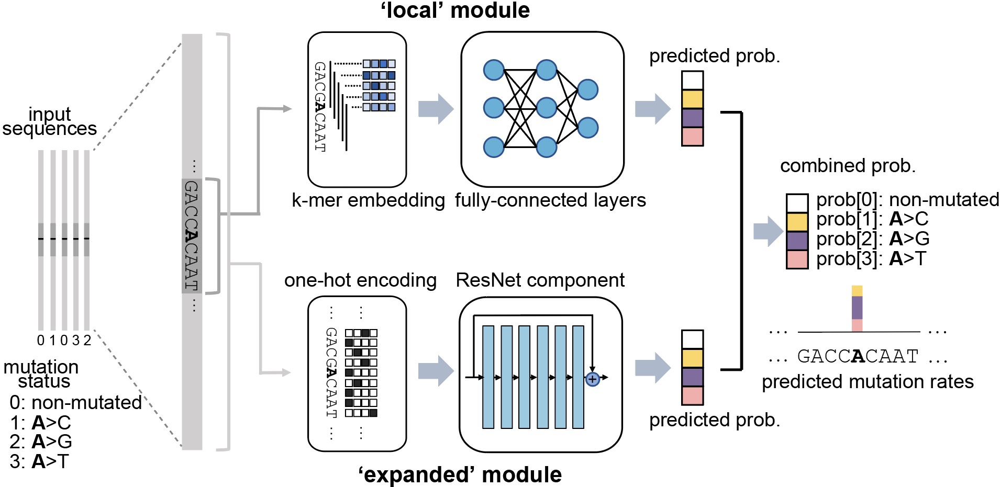
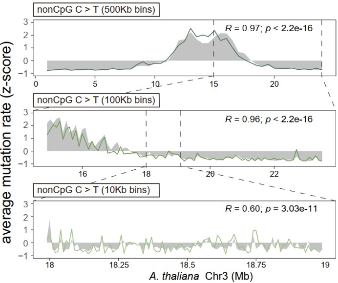

1. Overview
-----------

Germline mutation rates are crucial parameters in genetics, genomics and
evolutionary biology. It is long known that mutation rates vary
substantially across the genome, but existing methods can only obtain
very rough estimates of local mutation rates and are difficult to be
applied in non-model species.

**MuRaL**, short for **Mu**\ tation **Ra**\ te **L**\ earner, is a
generalizable framework to estimate single-nucleotide mutation rates
based on deep learning. MuRaL has better predictive performance at
different scales than current state-of-the-art methods. Moreover, it can
generate genome-wide mutation rate maps with rare variants from a
moderate number of sequenced individuals (e.g. ~100 individuals), and
can leverage transfer learning to further reduce data and time
requirements. It can be applied to many sequenced species with
population polymorphism data.

The MuRaL network architecture has two main modules (shown below), one
is for learning signals from local genomic regions (e.g. 10bp on each
side of the focal nucleotide), the other for learning signals from
expanded regions (e.g. 1Kb on each side of the focal nucleotide).

Below is an example showing that MuRaL-predicted rates (colored lines)
are highly correlated with observed mutation rates (grey shades) at
different scales on Chr3 of *A. thaliana*.

2. Installation
---------------

You can install MuRaL with conda, or download pre-built Singularity
images if Singularity works in your system. More details are given
below.

2.1 Using Conda
~~~~~~~~~~~~~~~~

MuRaL depends on several other packages, and we recommend using
`Miniconda <https://docs.conda.io/en/latest/miniconda.html>`__ (version
3 or newer) to create a conda environment for installing MuRaL and its
dependencies. Please refer to Miniconda's documentation for its
installation.

After installing Miniconda, download or clone the MuRaL source code from
github and go into the source code root folder 'MuRal-xxx/'.

MuRaL supports training and prediction with or without CUDA GPUs. Please
be aware that training tasks without GPUs could take a much longer time.
For most models, prediction tasks can be done with only CPUs.

Before installing MuRaL, use ``conda`` command from Miniconda to create
an environment and install the dependencies. The dependencies are
included in ``environment.yml`` (if using GPUs) or
``environment_cpu.yml`` (if CPU-only computing). Run one of the
following commands to create a conda environment and install the
dependencies (this may take >30 minutes depending on your internet
speed):

::

    # if your machine has GPUs
    conda env create -n mural -f environment.yml 

    # if the above command is interupted because of internet issues or some dependencies 
    # in environment.yml are updated, try the following:
    conda env update -n mural -f environment.yml --prune

    # if your machine has only CPUs
    conda env create -n mural -f environment_cpu.yml 

If the command ends without errors, you will have a conda environment
named 'mural'. Use the following command to activate the conda
environment:

::

    conda activate mural

And then install MuRaL by typing:

::

    pip install .

If the installation is complete, the following commands are available
from the command line. Type a commnad with '-h' option to see detailed
help message.

Main commands: 

* ``mural_train``: This tool is for training mutation rate models from 
the beginning. 
* ``mural_train_TL``: This tool is for training transfer learning models, 
taking advantage of learned weightsof a pre-trained model. 
* ``mural_predict``: This tool is forpredicting mutation rates of new sites with a trained model.

Auxiliary commands: \* ``get_best_mural_models``: This tool is for
finding the best model per trial, given the 'progress.csv' files of
trials. \* ``calc_mu_scaling_factor``: This tool is for calculating
scaling factors for generating per-generation mutation rates. \*
``scale_mu``: This tool is for scaling raw MuRaL-predicted mutation
rates into per-generation rates given a scaling factor.

2.2 Using Singularity
~~~~~~~~~~~~~~~~~~~~~

Singularity is a popular container platform for scientific research. We
also built Singularity images for specific versions, which can be found
at this `OSF repo <https://osf.io/rd9k5/>`__. You can just download the
Singularity image ``mural_vx.x.x.sif`` from the OSF repo and don't need
to install the dependencies of MuRaL. Once Singularity is installed in
your system, you can try running the MuRaL commands with the
``mural_vx.x.x.sif`` file.

If your machine has GPUs and you want to use GPU resources for MuRaL
tools, please remember to set the '--nv' flag for Singularity commands.
See the following examples:

::

    singularity exec --nv /path/to/mural_vx.x.x.sif mural_train ...
    singularity exec --nv /path/to/mural_vx.x.x.sif mural_train_TL ...

For prediction tasks, it is recommended to use only CPUs so that you can
run many prediction tasks in parallel. See the example below:

::

    singularity exec /path/to/mural_vx.x.x.sif mural_predict ...

For more about Singularity, please refer to the `Singularity
documentation <https://docs.sylabs.io>`__.

3. Usage examples 
------------------

3.1 Model training 
~~~~~~~~~~~~~~~~~~~

``mural_train`` trains MuRaL models with training and validation
mutation data, and exports training results under the "./ray\_results/"
folder. 

-  | Input data
   Input data files include the reference sequence file (FASTA format,
   required), a training data file (required) and a validation data file
   (optional). If the validation data file isn't provided, a fraction of
   the sites sampled from the training data file are used as validation
   data.
   Input training and validation data files are in BED format (more info
   about BED format
   `here <https://genome.ucsc.edu/FAQ/FAQformat.html#format1>`__). Some
   example lines of an input BED file are shown below.

   ::

    chr1    2333436 2333437 .   0   + 
    chr1    2333446 2333447 .   2   -
    chr1    2333468 2333469 .   1   -
    chr1    2333510 2333511 .   3   -
    chr1    2333812 2333813 .   0   - 

   In the BED-formatted lines above, the 5th column is used to represent
   mutation status: usually, '0' means the non-mutated status and other
   numbers for specific mutation types (e.g. '1' for 'A>C', '2' for 'A>G',
   '3' for 'A>T'). You can specify an arbitrary order for a group of
   mutation types with incremental numbers starting from 0, but make sure
   that the same order is consistently used in training, validation and
   testing datasets. Importantly, the training and validation BED file MUST
   BE SORTED by chromosome coordinates. You can sort BED files by
   ``bedtools sort`` or ``sort -k1,1 -k2,2n``.

-  | Output data
   ``mural_train`` saves the model information at each checkpoint,
   normally at the end of each training epoch of a trial. The
   checkpointed model files during training are saved under folders
   named like:

   ::

           ./ray_results/your_experiment_name/Train_xxx...xxx/checkpoint_x/
               - model
               - model.config.pkl
               - model.fdiri_cal.pkl

   In the above folder, the 'model' file contains the learned model
   parameters. The 'model.config.pkl' file contains configured
   hyperparameters of the model. The 'model.fdiri\_cal.pkl' file (if
   exists) contains the calibration model learned with validation data,
   which can be used for calibrating predicted mutation rates. These
   files can be used in downstream analyses such as model prediction and
   transfer learning. The 'progress.csv' files in 'Train\_xxx' folders
   contain important information for each training epoch of trials
   (e.g., validation loss, used time, etc.). One can use the command
   ``get_best_mural_models`` to find the best model per trial after
   training.

   ::

       get_best_mural_models ./ray_results/your_experiment_name/Train_*/progress.csv

-  | Example 1
   The following command will train a model by running two trials,
   using data in 'data/training.sorted.bed' for training. The training
   results will be saved under the folder './ray\_results/example1/'.
   Default values will be used for other unspecified arguments. Note
   that, by default, 10% of the sites sampled from 'training.sorted.bed'
   is used as validation data (i.e. '--valid\_ratio 0.1'). You can run
   this example under the 'examples/' folder in the package.

   ::

       mural_train --ref_genome data/seq.fa --train_data data/training.sorted.bed \
               --experiment_name example1 > test1.out 2> test1.err

-  | Example 2
   The following command will use data in 'data/training.sorted.bed'
   as training data and a separate 'data/validation.sorted.bed' as
   validation data. The option '--local\_radius 7' means that length of
   the local sequence used for training is 7\*2+1 = 15 bp.
   '--distal\_radius 200' means that length of the expanded sequence
   used for training is 200\*2+1 = 401 bp. You can run this example
   under the 'examples/' folder in the package.

   ::

       mural_train --ref_genome data/seq.fa --train_data data/training.sorted.bed \
               --validation_data data/validation.sorted.bed --n_trials 2 --local_radius 7 \
               --distal_radius 200 --experiment_name example2 > test2.out 2> test2.err

3.2 Model prediction 
~~~~~~~~~~~~~~~~~~~~~

| ``mural_predict`` predicts mutation rates for all sites in a BED file
based on a trained model. \* Input data
|  The required input files for prediction include the reference FASTA
file, a BED-formated data file and a trained model. The BED file is
organized in the same way as that for training. The 5th column can be
set to '0' if no observed mutations for the sites in the prediction BED.
The model-related files for input are 'model' and 'model.config.pkl',
which are generated at the training step. The file
'model.fdiri\_cal.pkl', which is for calibrating predicted mutation
rates, is optional. \* Output data
|  The output of ``mural_predict`` is a tab-separated file containing
the sequence coordinates (BED-formatted) and the predicted probabilities
for all possible mutation types. Usually, the 'prob0' column contains
probabilities for the non-mutated class and other 'probX' columns for
mutated classes. Some example lines of a prediction output file are
shown below.

::

    chrom   start   end    strand mut_type  prob0   prob1   prob2   prob3
    chr1    10006   10007   -       0       0.9797  0.003134 0.01444 0.002724
    chr1    10007   10008   +       0       0.9849  0.005517 0.00707 0.002520
    chr1    10008   10009   +       0       0.9817  0.004801 0.01006 0.003399
    chr1    10012   10013   -       0       0.9711  0.004898 0.02029 0.003746

-  | Example 3
   |  The following command will predict mutation rates for all sites in
   'data/testing.bed.gz' using model files under the
   'models/checkpoint\_6/' folder and save prediction results into
   'testing.ckpt6.fdiri.tsv.gz'. You can run this example under the
   'examples/' folder in the package.

   ::

       mural_predict --ref_genome data/seq.fa --test_data data/testing.bed.gz \
               --model_path models/checkpoint_6/model --model_config_path models/checkpoint_6/model.config.pkl \
               --calibrator_path models/checkpoint_6/model.fdiri_cal.pkl --pred_file testing.ckpt6.fdiri.tsv.gz \
               --without_h5 --cpu_only \
               > test3.out 2> test3.err

3.3 Transfer learning 
~~~~~~~~~~~~~~~~~~~~~~

| ``mural_train_TL`` trains MuRaL models like ``mural_train`` but
initializes model parameters with learned weights from a pre-trained
model. Its training results are also saved under the "./ray\_results/"
folder. \* Input data
|  The input files for ``mural_train_TL`` include the reference FASTA
file (required), a training data file (required), a validation data file
(optional), and model-related files of a trained model (required). The
required model-related files are 'model' and 'model.config.pkl' under a
specific checkpoint folder, normally generated by ``mural_train`` or
``mural_train_TL``. \* Output data
|  Output data has the same structure as that of ``mural_train``.

-  | Example 4
   |  The following command will train a transfer learning model using
   training data in 'data/training\_TL.sorted.bed', the validation data
   in 'data/validation.sorted.bed', and the model files under
   'models/checkpoint\_6/'. You can run this example under the
   'examples/' folder in the package.

   ::

       mural_train_TL --ref_genome data/seq.fa --train_data data/training_TL.sorted.bed \
               --validation_data data/validation.sorted.bed --model_path models/checkpoint_6/model \
               --model_config_path models/checkpoint_6/model.config.pkl --train_all \
               --init_fc_with_pretrained --experiment_name example4 > test4.out 2> test4.err

4. Scale MuRaL-predicted mutation rates to per base per generation rates
------------------------------------------------------------------------

The raw MuRaL-predicted mutation rates are not mutation rates per bp per
generation. To obtain a mutation rate per bp per generation for each
nucleotide, one can scale the MuRaL-predicted rates using reported
genome-wide DNM mutation rate and spectrum per generation. First, use
the command ``calc_mu_scaling_factor`` to calculate scaling factors for
specific groups of sites (e.g. A/T sites, C/G sites). Then use the
scaling factors to scale mutation rates in prediction files via the
command ``scale_mu``.

Note that we cannot compare or add up raw predicted rates from
different MuRaL models (e.g. A/T model and C/G model), but we can do
that with scaled mutation rates.

5. Trained models and predicted mutation rate profiles of multiple species
--------------------------------------------------------------------------

Trained models for four species - ***Homo sapiens***, ***Macaca
mulatta***, ***Arabidopsis thaliana*** and ***Drosophila melanogaster***
are provided in the 'models/' folder of the package. One can use these
model files for prediction or transfer learning.

Predicted single-nucleotide mutation rate profiles for these genomes are
available at
`ScienceDB <https://www.doi.org/10.11922/sciencedb.01173>`__.

6. Citation
-----------

Fang Y, Deng S, Li C. 2021. A generalizable deep learning framework for
inferring fine-scale germline mutation rate maps. bioRxiv
`doi:10.1101/2021.10.25.465689 <https://doi.org/10.1101/2021.10.25.465689>`__

7. Contact
----------

For reporting issues or requests related to the package, please write to
mural-project@outlook.com.
